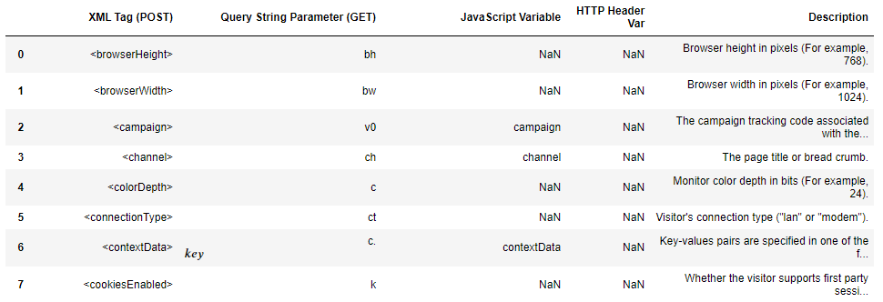
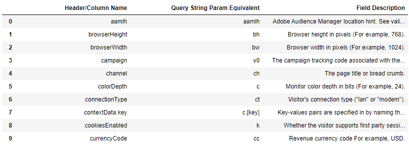

# Data Ingestion APIs

This documentation is providing information on the different Data Insertion APIs that are supported by the aanalytics2 python module.\
In order to use these new classes, you will need to import the ingestion module from the aanalytics2 library. They are not imported by default.

```python
import aanalytics2
from aanalytics2 import ingestion
```

**Note**
You will be require to import the configuration file if you want to use the "bulk-ingestion-api".\
We will cover that in the bulk ingestion API part.

## Data Insertion API

This API has been around Adobe Analytics for a very long time.
It is not part of the new Adobe Analytics API 2.0 environment.\
However it is not really part of the 1.4 or 1.3 either.

This method takes advantage of the normal collection servers of Adobe Analytics to send request to Analytics.\
Because there is no need for authentication and not dependency from the 1.4 api endpoints, I chose to support this API.\
It can come handy for generating request test.

The official documentation can be found [here](https://github.com/AdobeDocs/analytics-1.4-apis/blob/master/docs/data-insertion-api/index.md)

### Instanciating the Data Insertion API

The Data Insertion API can be instanciated by calling the DIAPI class.\
DIAPI stands for Data Insertion API.

The class instanciation requires 2 parameters:

* ReportSuite ID: your reportSuite where you want to send the data to.
* Tracking Server: the tracking server used for data collection.

Example: http

```python
import aanalytics2
from aanalytics2 import ingestion

diapi = ingestion.DIAPI("myrsid","myserver.sc.omtrdc.net")
```

There are requirement for the minimum fields you would need to send.
I will encourage you to read these requirements before you start using the Insertion API.

**Note**\
I have taken the decision to not provide a default visitor identification method you would like to use.\
I would recommend to use the "mid" parameter (for GET) or "marketingCloudVisitorID" (for POST) but didn't want to force any method. A visitor identification parameter is required to correctly process the data.

### Using GET Method

Once you have instantiated the DIAPI class, you can use that object to call the GET Method. The GET method enables you to send data using the GET insertion endpoint.
As explained above, some fields are expected to be populated when using the data insertion API. The GET method provide this information by having arguments predefined for these fields.\
Other arguments can be used as kwargs to send additional data.

Arguments:

* pageName : REQUIRED : The Web page name.
* g : REQUIRED  : The Web page URL
* pe : OPTIONAL : For custom link tracking (Type of link ("d", "e", or "o"))
* pev1 : OPTIONAL : The link's HREF. For custom links, page values are ignored.
* pev2 : OPTIONAL : Name of link. For custom links, page values are ignored.
* events : OPTIONAL : If you want to pass some events

Example of application:

```python

diapi.getMethod(mid=visitor,pageName="example",events="event4,event2",c1="http://www.example.com",v5=visitor)
## This will send data using the Marketing Cloud ID visitor identitification method.
## I have use eVar5 (v5), prop1 (c1), and events4 & 2 in my request.
```

For complete overview of the possible arguments you can pass.
You can call the REFERENCE attribute below.

### Using POST Method

Once you have instantiated the DIAPI class, you can use that object to call the POST Method. The POST method enables you to send data using the POST insertion endpoint.
As explained above, some fields are expected to be populated when using the data insertion API. The POST method provide this information by having arguments predefined for these fields.\
Other arguments can be used as kwargs to send additional data.

Arguments:

* pageName : REQUIRED : The Web page name.
* pageURL : REQUIRED  : The Web page URL
* linkType : OPTIONAL : For custom link tracking (Type of link ("d", "e", or "o"))
  * if selected, require "pev1" or "pev2", additionally pageName is set to Null
* linkURL : OPTIONAL : The link's HREF. For custom links, page values are ignored.
* linkName : OPTIONAL : Name of link.
* events : OPTIONAL : If you want to pass some events

Example of application:

```python

diapi.postMethod(marketingCloudVisitorID="123456823",pageURL="http://www.examplePOST.com",events="event4",prop1="http://www.examplePOST.com",eVar5="123456823")
## This will send data using the Marketing Cloud ID visitor identitification method.
## I have use eVar5 (v5) and events4 in my request.
```

For complete overview of the possible arguments you can pass.
You can call the REFERENCE attribute below.

### DIAPI Reference

The API wrapper provide part of the documentation officially hosted on the [github of Adobe](https://github.com/AdobeDocs/analytics-1.4-apis/blob/master/docs/data-insertion-api/reference/r_supported_tags.md).\
The documentation provided are references to the possible keys that can be used in the GET or POST methods.\
You can access the reference by using this method:

```python
data_ingestion.REFERENCE
```

It will return a pandas DataFrame of the supported keys:


## Bulk Ingestion API

This API is the new supported API, part of the Adobe Analytics API 2.0 library.\
In that regards, it requires user authentication and generation of a token.

In order to use the Bulk Ingestion API, you will need to import the configuration JSON file that the aanalytics2 module generate.\
For more information, read the [get-started documentation](./getting_started.md).

It is **mandatory** to import the config file in order to instanciating the bulk-ingestion API.

```python
import aanalytics2
from aanalytics2 import ingestion

aanalytics2.importConfigFile('myConfig.json')

```

### Instanciating the bulk-ingestion-api

Once you have imported the configuration file, you can instanciate the bulk ingestion API.
The bulk ingestion API provides 3 endpoints that can be used:

* <https://analytics-collection.adobe.io> (Auto-routing)
* <https://analytics-collection-va7.adobe.io> (US servers)
* <https://analytics-collection-nld2.adobe.io> (European servers)

By default, the module is using the auto-routing collection server.
In case you want to define a specific one to be used for legal reason, you can specify that when instanciating the bulk ingestion API.

```python
import aanalytics2
from aanalytics2 import ingestion

aanalytics2.importConfigFile('myConfig.json')

## Instanciate with European servers
bulkapi = ingestion.Bulkapi(endpoint="https://analytics-collection-nld2.adobe.io ")

```

### Generating a CSV template file

The API wrapper provides the capability to generate a minimum requirement CSV file for data ingestion.\
The file will be created in your working directory.

When creating the CSV template, you can define options through the arguments.\
Arguments:

* includeAdv : OPTIONAL : Include advanced fields in the csv (pe & queryString). Not included by default to avoid confusion for new users. (Default False)
* returnDF : OPTIONAL : Return a pandas dataFrame if you want to work directly with a data frame.(default False)
* save : OPTIONAL : Save the file created directly in your working folder.

```python
bulkapi.generateTemplate(includeAdv=False,returnDF=True,save=False)
```

### Validate file

The API provides an endpoint in order to validate the file format that you are going to send.\
I highly recommend using the method associated to this API in order to validate your setup.

In order to validate the file, you will need to use the validatation method.\
This method takes 1 argument:

* file : The CSV file that you would like to send. You can specify a CSV or an already gzipped version of your file.

It will return a response object from the requests python module.

```python
## sending CSV file
bulkapi.validation(file="data.csv")

## sending CSV Gzipped file
bulkapi.validation(file="data.csv.gz")
```

If you specify a CSV file, the module will automatically gzip it.
On this validation method, there is no file that are being created in that process.

### Sending files

In order to send files to the Analytics endpoint, you will need to use the "sendFiles" method.\
This method takes 1 argument:

* files: name of the file or list of files to be sent.

As you can see, you can send either one file at a time using this method or multiple files at a time by providing a list of file name to use.

In the case that you are sending data that are uncompressed (not Gzip files), gzip file will be generated in a tmp directory. This directory will be removed after the files have been processed.

This is not done if you already provide gzip compress files.

```python

## Using a list
myFiles = ['data_1.csv','data_2.csv']
bulk_api.sendFiles(myFiles)

## Using a single file
bulk_api.sendFiles('data.csv')

```

This method will return a list of response object for your files.

### Bulkapi Reference

The API wrapper provide part of the documentation officially hosted on the [github of Adobe](https://github.com/AdobeDocs/analytics-2.0-apis/blob/master/bdia.md).\
The documentation provided are references to the possible keys that can be used in the GET or POST methods.\
You can access the reference by using this method:

```python
bulkapi.REFERENCE
```

It will return a pandas DataFrame of the supported keys:

