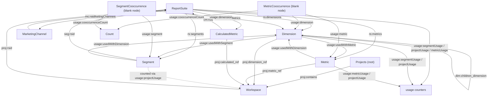

# Knowledge Graph

Adobe Analytics implementations accumulate hundreds of dimensions, metrics, segments, calculated metrics, and Workspace projects — with no built-in way to see how they relate to each other.\
The `knowledgegraph` module builds an [RDF](https://www.w3.org/RDF/) **Knowledge Graph** out of your Adobe Analytics implementation, connecting every component (dimensions, metrics, marketing channels, segments, calculated metrics, date ranges) to the report suites they belong to, and — when Workspace projects are loaded — to each other, through actual usage.

It relies on the `WorkspaceManager` class to parse Workspace project definitions, and on [`rdflib`](https://rdflib.readthedocs.io/) to build, serialize, and query the resulting graph with SPARQL.

> **Not loaded by default**: unlike most of the package, `KnowledgeGraph` is **not** re-exported from the top-level `aanalytics2` package (no `import aanalytics2; aanalytics2.KnowledgeGraph(...)`). Import it explicitly from its module:
> ```py
> from aanalytics2.knowledgegraph import KnowledgeGraph
> ```

## Menu
- [Overview](#overview)
- [Importing the module](#importing-the-module)
- [Instantiation](#instantiation)
  - [What happens at instantiation](#what-happens-at-instantiation)
- [Attributes](#attributes)
- [Methods](#methods)
  - [loadProjects](#loadprojects)
  - [buildGraph](#buildgraph)
  - [exportGraph](#exportgraph)
  - [query](#query)
- [Complete Example](#complete-example)
- [Ontology](#ontology)
  - [Namespaces](#namespaces)
  - [Node types](#node-types)
  - [Predicates](#predicates)
  - [Mermaid Diagram](#mermaid-diagram)

## Overview

Building the graph creates RDF entities (as `URIRef` nodes) for:

* **ReportSuite** — one per rsid considered.
* **Dimension** / **Metric** — scoped per report suite (the same dimension ID on two report suites becomes two distinct nodes).
* **MarketingChannel** — the marketing channel rules configured for a report suite.
* **Segment** / **CalculatedMetric** / **DateRange** — company-wide (not scoped to a single report suite).
* **Workspace** — one per project loaded via `loadProjects`.

On top of these entities, `buildGraph` derives two kinds of relationships that aren't available anywhere else in the API:

* **Usage counts** : how many times each dimension, metric, segment, calculated metric, and report suite is referenced across segments, calculated metrics, and loaded Workspace projects (`segmentUsage`, `metricUsage`, `projectUsage`).
* **Co-occurrence** : which dimensions are used *together with* which metrics, and which dimensions are used *together with* which segments, inside the same Workspace visualization — with a count of how often that pairing occurs.

The result is a `rdflib.Graph` that can be serialized to Turtle (`.ttl`) and queried with SPARQL, or explored with any RDF-compatible tool. The full node/predicate vocabulary is described in [Ontology](#ontology).

## Importing the module

```py
from aanalytics2.knowledgegraph import KnowledgeGraph
```

## Instantiation

`KnowledgeGraph` connects to Adobe Analytics on instantiation — it needs a `config` object the same way `Analytics` or `Login` do.

```py
import aanalytics2 as api2
from aanalytics2.knowledgegraph import KnowledgeGraph

cfg = api2.importConfigFile('config_analytics.json', return_object=True)

# Auto-detect the most commonly used report suite from your projects
kg = KnowledgeGraph(config=cfg)

# Build the graph across every report suite in the company
kg_all = KnowledgeGraph(config=cfg, rsids="all")

# Restrict to specific report suites
kg_some = KnowledgeGraph(config=cfg, rsids=["rsid_a", "rsid_b"])
```

Arguments:
* config : OPTIONAL : The config dictionary/`ConfigObj` returned by `importConfigFile(..., return_object=True)` (or `configure(..., return_object=True)`).
* companyId : OPTIONAL : The company ID to use for building the knowledge graph. If not provided, the first company ID returned by `Login.getCompanyId()` is used.
* rsids : OPTIONAL : Which report suite(s) to include (`list[str]`, `str`, or `"all"`).
  * Not provided (default) : the report suite ID most frequently used across your Workspace projects is auto-detected and used.
  * `"all"` : every (non-virtual) report suite in the company is used.
  * `str` : a single report suite ID.
  * `list` : an explicit list of report suite IDs.
* filterDims : OPTIONAL : If set to `True` (default), entry/exit dimensions (`/entry`, `/exit`) are excluded and only Oberon-reportable dimensions are kept.

### What happens at instantiation

Instantiating the class performs several API calls right away, before you call any method:

1. Connects via `Login` and resolves the `companyId`.
2. Retrieves the report suites (`getReportSuites(extended_info=True)`).
3. Resolves `rsids` (auto-detecting from your most-used project's report suite when not provided).
4. Fetches dimensions, metrics, and marketing channels **per report suite concurrently** (`ThreadPoolExecutor`, up to 10 workers).
5. Fetches segments, calculated metrics, date ranges, project stubs, and annotations for the whole company.
6. Builds one `rdflib.Namespace` per entity type (plus one dimension/metric namespace per report suite), stored in `kg.namespaces`. See [Namespaces](#namespaces).

## Attributes

Once instantiated, the `KnowledgeGraph` object exposes the following attributes:

* `kg.companyId` : the resolved company ID.
* `kg.rsids` : the list of report suite IDs considered.
* `kg.reportSuites` : `DataFrame` of report suite metadata.
* `kg.dimensions` / `kg.metrics` : `dict` keyed by rsid, each value a raw list of dimension/metric dicts.
* `kg.marketingChannels` : `dict` keyed by rsid.
* `kg.segments` / `kg.calculatedMetrics` / `kg.dateRanges` : raw lists (extended info), company-wide.
* `kg.projects` : raw list of project stubs (`id`, `name`, `rsid`, `modified`, …) — not full definitions. Use `loadProjects` to fetch full definitions.
* `kg.annotations` : raw list of annotations.
* `kg.namespaces` : `dict` of `rdflib.Namespace` objects, one per entity type (`"segments"`, `"metrics"`, `"reportSuites"`, `"usage"`, …), plus one `"{rsid}/dimensions"` / `"{rsid}/metrics"` pair per report suite. See [Namespaces](#namespaces).
* `kg.project_details` : populated by `loadProjects` — list of `WorkspaceManager` instances, one per loaded project.
* `kg.graph` : populated by `buildGraph` — the resulting `rdflib.Graph`.

## Methods

### loadProjects

Fetch full Workspace project definitions and parse them (via `WorkspaceManager`) so `buildGraph` can extract dimension/metric/segment/calculated-metric usage and co-occurrence from them.\
This step is optional — without it, `buildGraph` still produces the full component graph and usage counts from segments and calculated metrics, but no project-derived usage or co-occurrence.

```py
# Load the 20 most recently modified projects
kg.loadProjects(20)

# Load a random sample of 20 projects instead
kg.loadProjects(20, sampleMethod='random')

# Load specific projects by ID
kg.loadProjects(['5f9...abc', '5f9...def'])

# Load every project in the company (can take a long time)
kg.loadProjects('all')
```

Arguments:
* projects : REQUIRED : Which projects to load.
  * `int` : number of projects to load, selected via `sampleMethod`.
  * `list` : explicit list of project IDs.
  * `"all"` : every project in the company. This fetches each project definition individually and can take a large amount of time on big accounts.
* sampleMethod : OPTIONAL : Used only when `projects` is an `int`. (str : default `'most_recent'`)
  * `'most_recent'` : the most recently modified projects.
  * `'random'` : a random sample of projects.

Project definitions are fetched concurrently (`ThreadPoolExecutor`, up to 6 workers) and stored as `WorkspaceManager` instances in `kg.project_details`.

### buildGraph

Build the RDF graph from everything fetched at instantiation (and from `kg.project_details`, if `loadProjects` was called beforehand).

```py
graph = kg.buildGraph()

# Build and save straight to a Turtle file
graph = kg.buildGraph(save=True, filename='my_graph.ttl')

# Print progress while building
graph = kg.buildGraph(verbose=True)
```

Arguments:
* save : OPTIONAL : If set to `True`, serializes the graph to a Turtle file. (bool : default `False`)
* filename : OPTIONAL : Filename used when `save=True`. A `.ttl` extension is appended automatically if missing. (str : default `'knowledge_graph.ttl'`)
* verbose : OPTIONAL : If set to `True`, prints progress statements while the graph is being built.

Returns the built `rdflib.Graph`, also stored on `kg.graph`.

What gets added to the graph:
* One node per **ReportSuite**, **Dimension**, **Metric**, **MarketingChannel**, **Segment**, **CalculatedMetric**, and **DateRange**, each carrying its own properties (`RDFS.label`, `id`, `type`, `reportable`, `segmentable`, tags, share counts, last-access timestamps, …) under its entity namespace (`kg.namespaces[...]`).
* Classification dimensions (IDs containing `.`) are linked to their parent via `parent_dimension` / `children_dimension` predicates.
* Every `Segment` and `CalculatedMetric` is scanned (`scanSegment` / `scanCalculatedMetric`) to increment `usage.segmentUsage` / `usage.metricUsage` on every dimension/metric/report suite it references.
* One **Workspace** node per project in `kg.project_details` (populated by `loadProjects`), linked to its report suite, with each panel's text, freeform table, and visualization content attached, and every dimension/metric/calculated-metric/segment it uses incrementing `usage.projectUsage`.
* **Co-occurrence** blank nodes: a `MetricCooccurrence` node for every (dimension, metric) pair found together in the same Workspace visualization, and a `SegmentCooccurrence` node for every (dimension, segment) pair — each carrying a `cooccurrenceCount` and the `rsid` it was observed on. The dimension and metric/segment nodes are additionally linked directly via `usedWithMetric` / `usedWithDimension` and `usedWithSegment` / `usedWithDimension` predicates.

The full list of node types and predicates produced here is detailed in [Ontology](#ontology).

### exportGraph

Serialize the already-built graph (`kg.graph`) to a Turtle file. Use this when you want to save the graph separately from `buildGraph`, e.g. after running additional edits on `kg.graph`.

```py
kg.exportGraph(filename='my_graph.ttl')
```

Arguments:
* filename : REQUIRED : The name of the Turtle file to write. A `.ttl` extension is appended automatically if missing.

### query

Run a SPARQL query against the graph built by `buildGraph()`.\
Unlike calling `kg.graph.query(...)` directly, this returns a list of plain Python dictionaries (one per result row, values converted with `.toPython()`) instead of raw `rdflib` `Result` rows — easier to load straight into a `pandas.DataFrame`.

```py
rows = kg.query("""
    PREFIX usage: <http://analytics.com/COMPANYID/usage#>
    SELECT ?dimension ?count WHERE {
        ?dimension usage:projectUsage ?count .
    }
    ORDER BY DESC(?count)
    LIMIT 10
""")

import pandas as pd
df = pd.DataFrame(rows)
```

Arguments:
* sparql_string : REQUIRED : The SPARQL query to execute.

Returns a `list` of `dict`, one per result row, keyed by SPARQL variable name.

## Complete Example

```py
import aanalytics2 as api2
from aanalytics2.knowledgegraph import KnowledgeGraph

# 1. Authenticate
cfg = api2.importConfigFile('config_analytics.json', return_object=True)

# 2. Build the component graph across every report suite
kg = KnowledgeGraph(config=cfg, rsids="all")

# 3. Load the 50 most recently modified projects to enrich the graph
#    with real usage and co-occurrence data
kg.loadProjects(50, sampleMethod='most_recent')

# 4. Build and save the graph
graph = kg.buildGraph(save=True, filename='analytics_knowledge_graph.ttl', verbose=True)

# 5. Query it — e.g. the 10 most-used dimensions across loaded projects
rows = kg.query(f"""
    PREFIX usage: <http://analytics.com/{kg.companyId}/usage#>
    SELECT ?dimension ?count WHERE {{
        ?dimension usage:projectUsage ?count .
    }}
    ORDER BY DESC(?count)
    LIMIT 10
""")
for row in rows:
    print(row['dimension'], row['count'])

# 6. Re-export the graph later without rebuilding it
kg.exportGraph(filename='analytics_knowledge_graph_backup.ttl')
```

## Ontology

> This section is also shipped as a standalone file, [`aanalytics2/resources/kg_ontology.md`](../aanalytics2/resources/kg_ontology.md), which the [MCP server](./mcp_server.md#knowledge-graph-ontology-resource) serves to LLM clients as the `ontology://knowledge-graph` resource. Keep the two in sync when the schema changes.

### Namespaces

For a company with ID `{companyId}`, the following namespaces are minted at instantiation and stored in `kg.namespaces`:

| Key in `kg.namespaces` | URI pattern | Used for |
| -- | -- | -- |
| `reportSuites` | `http://analytics.com/{companyId}/reportSuite#` | ReportSuite nodes (`reportSuites[rsid]`) and the `rs:*` predicates |
| `dimensions` | `http://analytics.com/{companyId}/dimension#` | the `dim:*` predicates attached to Dimension nodes |
| `metrics` | `http://analytics.com/{companyId}/metric#` | the `met:*` predicates attached to Metric nodes |
| `marketingChannels` | `http://analytics.com/{companyId}/marketingChannel#` | the `mc:*` predicates attached to MarketingChannel nodes |
| `segments` | `http://analytics.com/{companyId}/segment#` | the `seg:*` predicates attached to Segment nodes |
| `calculatedMetrics` | `http://analytics.com/{companyId}/calculatedMetric#` | the `cm:*` predicates attached to CalculatedMetric nodes |
| `dateRange` | `http://analytics.com/{companyId}/dateRange#` | the `dr:*` predicates attached to DateRange nodes |
| `projects` | `http://analytics.com/{companyId}/projects#` | the `proj:*` predicates, and the URI of the single "projects root" node |
| `usage` | `http://analytics.com/{companyId}/usage#` | the `usage:*` predicates (usage counts, co-occurrence) |
| `{rsid}/dimensions`, `{rsid}/metrics` | `http://analytics.com/{companyId}/{rsid}/dimension#` / `.../{rsid}/metric#` | one pair per report suite, bound as serialization prefixes — the actual Dimension/Metric node URIs use the pattern below, not these namespace objects |

Entity **nodes** (other than `ReportSuite`) are not minted from the namespace objects above — each has its own dedicated URI template:

| Entity | Node URI pattern |
| -- | -- |
| ReportSuite | `http://analytics.com/{companyId}/reportSuite#{rsid}` |
| Dimension | `http://analytics.com/{companyId}/{rsid}/dimension/{dimensionId}` |
| Metric | `http://analytics.com/{companyId}/{rsid}/metric/{metricId}` |
| MarketingChannel container (one per rsid) | `http://analytics.com/{companyId}/{rsid}/marketingChannel/` |
| MarketingChannel (each configured channel) | `http://analytics.com/{companyId}/{rsid}/marketingChannel/{channelId}` |
| Segment | `http://analytics.com/{companyId}/segment/{segmentId}` |
| CalculatedMetric | `http://analytics.com/{companyId}/calculatedMetric/{calculatedMetricId}` |
| DateRange | `http://analytics.com/{companyId}/dateRange/{dateRangeId}` |
| Workspace (project) | `http://analytics.com/{companyId}/projects/{projectId}` |
| Projects root | `http://analytics.com/{companyId}/projects#` (the `projects` namespace itself, used as a single node every Workspace is attached to via `proj:contains`) |
| MetricCooccurrence / SegmentCooccurrence | blank node (`BNode()`) — no stable URI; found via the `usage:dimension` + `usage:metric`/`usage:segment` predicates |

### Node types

Nodes are typed with `rdf:type` (`RDF.type`) using the following (literal) values:

| rdf:type | Meaning |
| -- | -- |
| `ReportSuite` | a report suite |
| `Dimension` | a dimension, scoped to one report suite |
| `Metric` | a metric, scoped to one report suite |
| `MarketingChannels` | the marketing channel container for a report suite |
| `MarketingChannel` | one configured marketing channel rule |
| `Segment` | a segment (company-wide) |
| `CalculatedMetric` | a calculated metric (company-wide) |
| `DateRange` | a date range (company-wide) |
| `Workspace` | a Workspace project — only present after `loadProjects` + `buildGraph` |
| `MetricCooccurrence` | blank node recording that a dimension and a metric were used together in a Workspace visualization, with a `cooccurrenceCount` |
| `SegmentCooccurrence` | blank node recording that a dimension and a segment were used together in a Workspace visualization, with a `cooccurrenceCount` |

### Predicates

The tables below use short prefixes for readability. They map to `kg.namespaces` as follows:

```
dim   → kg.namespaces['dimensions']
met   → kg.namespaces['metrics']
mc    → kg.namespaces['marketingChannels']
seg   → kg.namespaces['segments']
cm    → kg.namespaces['calculatedMetrics']
rs    → kg.namespaces['reportSuites']
dr    → kg.namespaces['dateRange']
proj  → kg.namespaces['projects']
usage → kg.namespaces['usage']
```

| Predicate | Usage |
| -- | -- |
| `rdf:type` | node type, see [Node types](#node-types) |
| `rdfs:label` | human-readable name of a node |
| `rdfs:comment` | description of a node, when the source component has one |
| `dim:id` / `met:id` / `seg:id` / `cm:id` / `mc:id` / `dr:id` / `rs:id` | the raw Adobe Analytics component ID |
| `dim:dataType` | dimension data type (`string`, `int`, …) |
| `dim:classification` | `true` / `false` — whether the dimension ID contains a `.` (classification / sub-classification) |
| `dim:parent_dimension` / `dim:children_dimension` | links a classification dimension to its parent, and back |
| `dim:reportable` / `met:reportable` / `cm:reportable` | one triple per supported report type / product |
| `dim:segmentable` / `met:segmentable` | boolean |
| `dim:rsid` / `met:rsid` / `mc:rsid` / `seg:rsid` / `cm:rsid` | link from the component to its owning ReportSuite node |
| `met:type` / `cm:type` | metric / calculated metric type |
| `met:polarity` / `cm:polarity` | `positive` / `negative` |
| `mc:defines` | the marketing channel container → each configured channel |
| `mc:position` / `mc:override` / `mc:enabled` | channel rule configuration |
| `rs:currency` | ReportSuite currency |
| `rs:dimensions` / `rs:metrics` / `rs:marketingChannels` / `rs:segments` / `rs:calculatedMetrics` | ReportSuite → each of its component nodes |
| `seg:definition` / `cm:definition` | segment / calculated metric definition (JSON, as a string literal) |
| `seg:lastAccess` / `cm:lastAccess` | last recorded access, `xsd:dateTime` |
| `seg:tag` / `cm:tag` | one triple per tag name |
| `seg:shares` / `cm:shares` | number of shares |
| `dr:description` / `dr:definition` | date range metadata |
| `proj:contains` | the projects root node → each loaded Workspace |
| `proj:rsid` | Workspace → its ReportSuite |
| `proj:description` / `proj:created` | Workspace metadata |
| `proj:text` | text panel content (title, and body when not empty) |
| `proj:visualition` *(sic — kept as-is to match the current implementation)* | name of a Visualization panel |
| `proj:panelFreeForm` | name (and description) of a FreeForm panel |
| `proj:dimension_ref` / `proj:metric_ref` / `proj:calculated_ref` | back-links from a Dimension / Metric / CalculatedMetric node to every Workspace that uses it |
| `usage:segmentUsage` / `usage:projectUsage` / `usage:metricUsage` | integer counters on Dimension/Metric/ReportSuite/Segment/CalculatedMetric nodes: how many times it is referenced by segments, Workspace projects, or calculated metrics respectively |
| `usage:usedWithMetric` / `usage:usedWithDimension` | direct co-occurrence edge between a Dimension and a Metric node (both directions) |
| `usage:usedWithSegment` / `usage:usedWithDimension` | direct co-occurrence edge between a Dimension and a Segment node (both directions) |
| `usage:dimension` / `usage:metric` / `usage:segment` | from a `MetricCooccurrence` / `SegmentCooccurrence` blank node to the Dimension/Metric/Segment it relates |
| `usage:cooccurrenceCount` | how many times that specific pairing was observed |
| `usage:rsid` | from a cooccurrence blank node to the ReportSuite it was observed on |

### Mermaid Diagram

Below is a Mermaid diagram of the main artefacts and relationships in the knowledge graph. It is not exhaustive, but it gives a good overview of the graph structure.


